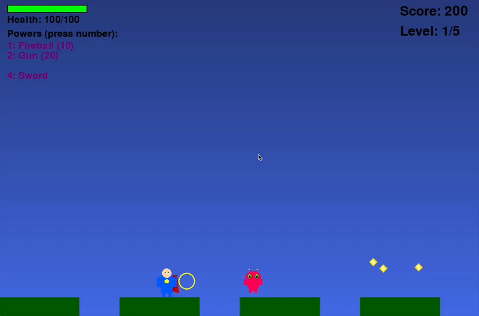

# Puncher! 🦸‍♂️

A superhero side-scrolling adventure game where you save the world from alien invaders!

Made with my son in an afternoon using cursor.

## Demo



## About

**Puncher!** is a fun, family-friendly 2D side-scrolling game designed for players aged 7 and up. Take on the role of a superhero fighting off alien invaders with various powers and abilities!

## Features

- **Side-scrolling Action**: Move through randomly generated levels
- **Combat System**: Punch enemies and use special power-ups
- **Power-ups**: Collect and use 6 different abilities:
  - 🔥 Fireball
  - 🔫 Gun
  - 🛡️ Shield
  - ⚔️ Sword
  - 🏹 Bow and Arrow
  - 👁️ Laser Eyes
- **Treasure Collection**: Gather coins and treasures for points
- **5 Progressive Levels**: Each level gets more challenging
- **Debug Mode**: Press 'D' to visualize collision areas

## Controls

- **Arrow Keys**: Move and Jump
- **Space**: Punch
- **Down Arrow**: Sneak
- **Numbers 1-6**: Use Power-ups
- **D**: Toggle Debug Mode (show collision areas)
- **Enter**: Start Game / Return to Menu
- **Escape**: Pause Game

## Installation

1. Clone this repository:
   ```bash
   git clone <repository-url>
   cd puncher-game
   ```

2. Create a virtual environment:
   ```bash
   python -m venv .venv
   source .venv/bin/activate  # On Windows: .venv\Scripts\activate
   ```

3. Install dependencies:
   ```bash
   pip install -r requirements.txt
   ```

4. Run the game:
   ```bash
   python main.py
   ```

## Gameplay

- **Objective**: Fight through 5 levels of alien invaders to save the world!
- **Scoring**: Earn points by defeating enemies and collecting treasures
- **Health**: Watch your health bar - take cover when needed
- **Power-ups**: Collect power-ups to enhance your abilities
- **Level Progression**: Reach the goal at the end of each level to advance

## Technical Features

- Built with **pygame** for smooth 2D graphics
- Custom sprite generation system
- Improved collision detection for reliable pickup mechanics
- Camera system that follows the player
- Visual debugging tools for development

## Recent Improvements

- ✅ Fixed collision detection issues with treasures and power-ups
- ✅ Added expanded pickup areas for easier item collection
- ✅ Implemented rectangle-based collision detection
- ✅ Added debug mode for collision visualization
- ✅ Improved sprite positioning for better reachability

## Development

This game was built using Python and pygame. The codebase includes:

- `main.py`: Core game logic and classes
- `sprites.py`: Sprite generation utilities
- `requirements.txt`: Project dependencies
- `SPEC.md`: Original game specification

## Contributing

Feel free to submit issues and pull requests to improve the game!

## License

This project is open source and available under the MIT License.
